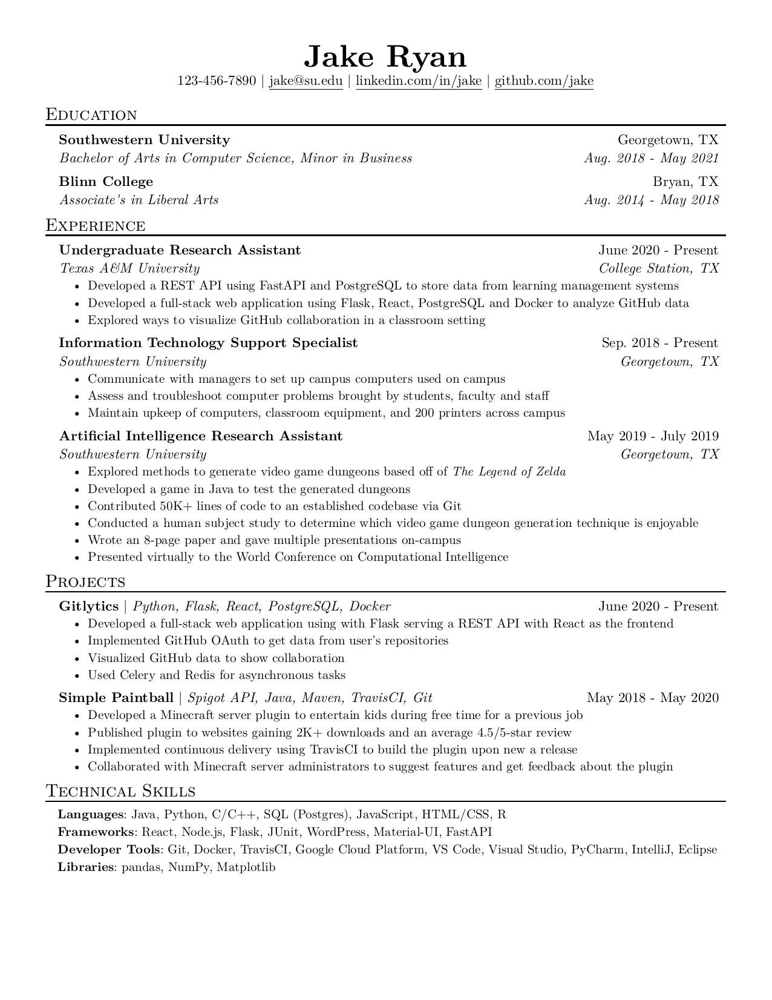

# NNJR

NNJR: **N**NJR is **N**ot **J**ake's **R**esume. However, it is similar and is
written in `Typst`! 



## Usage

### [Typst.app](https://typst.app)

Upload `resume.typ` to your Typst project. Change what you want and voila!

Shared project demo [here](https://typst.app/project/rdCXm00mYQiDPpLtSCK4xs)

https://typst.app/project/rdCXm00mYQiDPpLtSCK4xs

### Typst CLI

```sh
# Compile to resume.pdf
typst compile resume.typ

# Compile to other path and name
typst compile resume.typ your/path/here.pdf

# Watch
typst watch resume.pdf
```

